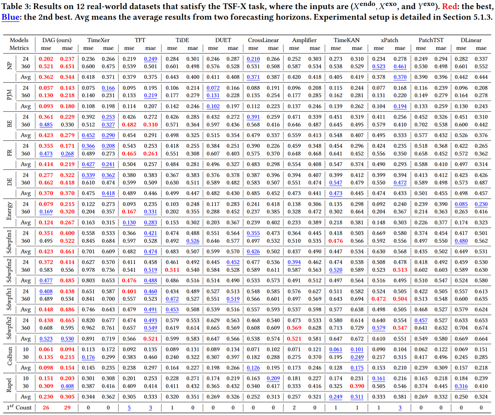

#  DAG: A Dual Causal Network for Time Series Forecasting with Exogenous Variables

[](https://www.python.org/)  [](https://pytorch.org/)

This code is the official PyTorch implementation of our paper, [DAG](https://arxiv.org/pdf/2509.14933): A Dual Causal Network for Time Series Forecasting with Exogenous Variables.

If you find this project helpful, please don't forget to give it a ⭐ Star to show your support. Thank you!


🚩 News (2025.10) We have open-sourced the [covariate time series forecasting leaderboard](https://decisionintelligence.github.io/OpenTS/leaderboards/#covariate_forecasting).


## Introduction
DAG, which utilizes Dual cAusal network along both the temporal and channel dimensions for time series forecasting with exoGenous variables, especially leveraging future exogenous variable information. 

The framework introduces a Temporal Causal Module which includes a temporal causal discovery module to model how historical exogenous variables affect future exogenous variables, followed by a causal injection module to incorporate these relationships for forecasting future endogenous variables. 

Additionally, a Channel Causal Module is introduced. It features a channel causal discovery module to model the impact of historical exogenous variables on historical endogenous variables and injects these relationships for improved forecasting of future endogenous variables based on future exogenous variables.

<div align="center">

</div>

## Quickstart

> [!IMPORTANT]
> this project is fully tested under python 3.8, it is recommended that you set the Python version to 3.8.
1. Requirements

Given a python environment (**note**: this project is fully tested under python 3.8), install the dependencies with the following command:

```shell
pip install -r requirements.txt
```

2. Data preparation

You can obtained the well pre-processed datasets from [Google Drive](https://drive.google.com/file/d/1K2AvogpOpSz1PiQ53dPchzGv_PqlCWAK/view?usp=sharing). Then place the downloaded data under the folder `./dataset`. 

3. Train and evaluate model

- To see the model structure of DAG,  [click here](./ts_benchmark/baselines/dag/models/dag_model.py).
- We provide all the experiment scripts for DAG and other baselines under the folder `./scripts/covariate_forecasting`.  For example you can reproduce all the experiment results as the following script:

```shell
sh ./scripts/covariate_forecasting/DAG.sh
```


## Results
We utilize the Time Series Forecasting Benchmark (TFB) code repository as a unified evaluation framework, providing access to **all baseline codes, scripts, and results**. Following the settings in TFB, we do not apply the **"Drop Last"** trick to ensure a fair comparison.

<div align="center">

</div>

<div align="center">

</div>


## Contact

If you have any questions or suggestions, feel free to contact:

- [Xiangfei Qiu](https://qiu69.github.io/) (xfqiu@stu.ecnu.edu.cn)

Or describe it in Issues.
